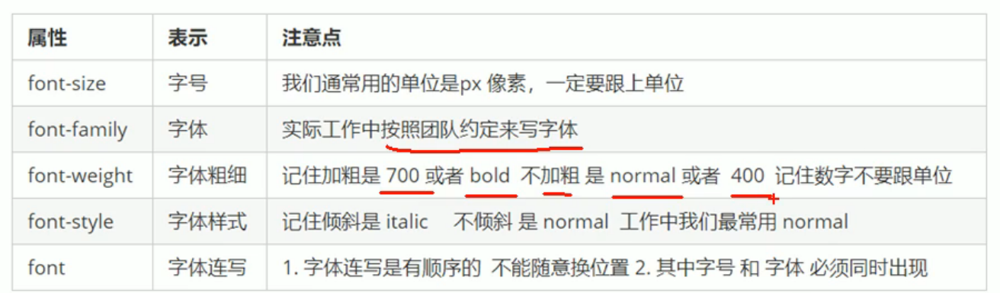
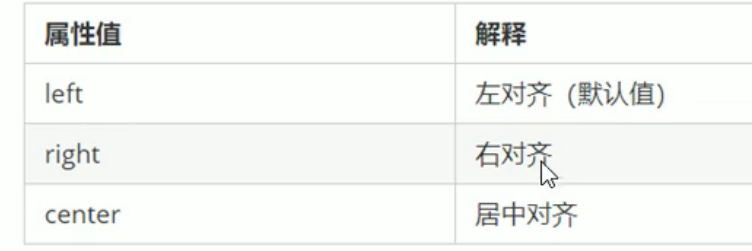
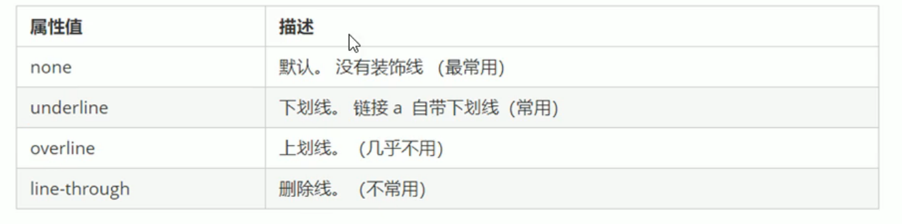
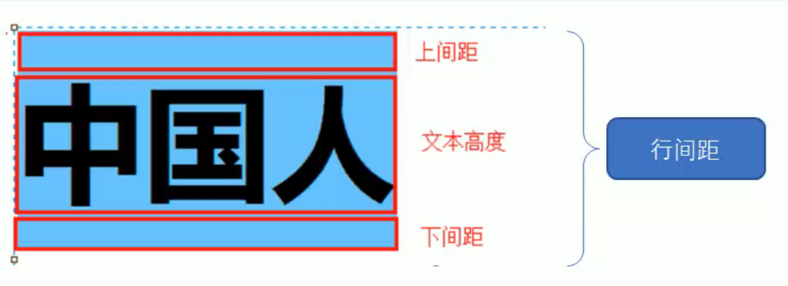
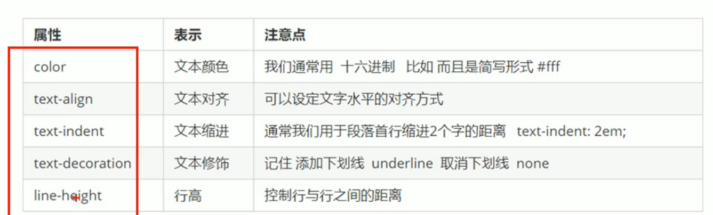
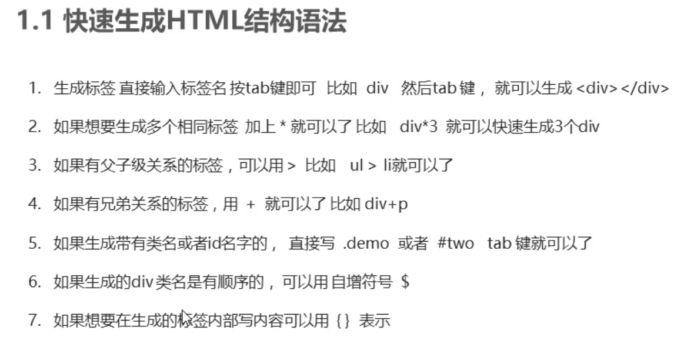
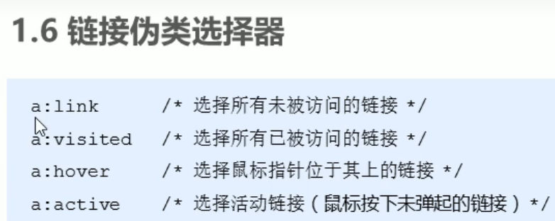

### 表格标签

- rowspan 跨列合并单元格
- colspan 跨行合并单元格
- table tr td th
- thead tbody

### 列表标签

- ul li 无序列表
- ol li 有序列表
- dl dt dd 自定义列表

### 表单

- 表单域 form 标签
- 表单控件
- 提示信息
- input 表单元素

### 文字样式

- italic 倾斜
- normal 字体样式还原
- font: font-sytle font-weight font-size/line-height font-family;
- 不能更换顺序，不需要设置的属性可以省略，但必须保留 font-size font-family  
  
- color 定义文本的颜色 预定义颜色，十六进制，rgb 代码
- text-align 元素内文本内容的水平对齐方式
  

### 装饰文本

- text-decoration 规定添加到文本的修饰 上划线 下划线 删除线等等
  
- text-indent 缩进 em 是相对单位 相对于当前元素文字大小
- 行间距 line-height
  
  
- 快速生成语法
  
- 后代选择器用空格隔开 ul li

```css
ol li {
  color: pink;
}
.nav li a {
  color: black;
}
```

- 子选择器 只能选择某元素的最近一级子元素，简单理解就是选亲儿子元素

```css
ol > li {
  color: pink;
}
```

- 并集选择器：选择多组标签，并为他们定义相同的样式，通常用于集体声明。

```css
div,
p,
span,
ul li {
  color: pink;
}
```

### 伪类选择器

 

- 链接伪类声明顺序 LVHA link visited hover active


### 块元素

- 比较霸道，自己独占一行
- 高度，宽度，外边距一级内边距都可以控制
- 宽度默认是容器的 100%
- 是一个容器及盒子，里面可以放房内或者块级元素

```css
a{
  /* 文本样式 */
  text-decoration: none;
  /* 缩进 */
   text-indent：2em;
}
```

```css
p {
  background-color: #fa9289;
  position: absolute;
  position: sticky;
  position: relative;
}
```

- 隐藏元素

```css
.a1 {
  background-color: pink;
  /* visibility: visible; */
  visibility: hidden;
}

.a2 {
  background-color: rgb(143, 102, 109);
  /* display: none; */
}
```

- overflow 溢出：visible、auto、hidden、scroll

```css
.overflow {
  background-color: aquamarine;
  overflow: auto;
}
```

- background

```css
.mask {
  width: 100%;
  height: 100%;
  background: rgb(0, 0, 0, 0.3) url(../img/arr.png) no-repeat center;
  position: absolute;
  top: 0;
  left: 0;
  /* visibility: hidden; */
}
```

### 精灵图

- 一张大图里面使用各个小图
~~~css
 .z {
      width: 116px;
       height: 150px;
            background: url(../img/abcd.jpg) no-repeat;
            background-position: -477px -545px;
     }
~~~

### 鼠标样式

~~~html
 <ul>
        <li style="cursor : pointer;">pointer</li>
        <li style="cursor:not-allowed"> not-allowed</li>
        <li style="cursor:text">text</li>
        <li style="cursor:move">move</li>
        <li style="cursor:default"> default</li>
    </ul>
~~~
